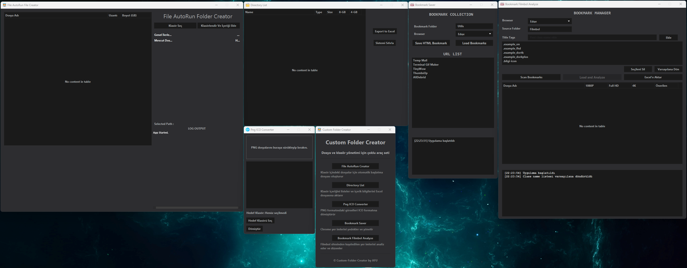

# Custom Folder Creator



A comprehensive JavaFX desktop application that simplifies file management, image conversion, and bookmark organization tasks.

## 📋 About This Project

I built **Custom Folder Creator** because I was tired of juggling multiple tools for different file management tasks. This all-in-one solution combines everything you need for organizing your digital life - from converting images to managing bookmarks, all wrapped in a sleek dark theme interface that's easy on the eyes.

## ✨ What's Inside

The app comes with five powerful modules that cover most of your file management needs:

### 🚀 File AutoRun Creator
Ever wanted to quickly organize your video collection? This module scans your folders, analyzes video files using MediaInfo, and automatically downloads posters from the web. It creates organized folders for each file and generates detailed media information - perfect for movie enthusiasts who want their collection properly cataloged.

### 📊 Directory List
Need to analyze disk usage or plan storage? This tool lists all files in a directory, calculates how many 8GB or 4GB DVDs you'd need, and exports everything to Excel. Just drag and drop files, and you'll get comprehensive reports with file sizes, types, and storage calculations.

### 🖼️ PNG to ICO Converter
Converting images to Windows icons used to be a hassle. Not anymore! Simply drag your PNG files, select a destination folder, and watch them transform into proper ICO files. The converter automatically resizes everything to 256x256 pixels and handles batch processing like a champ.

### 🔖 Bookmark Saver
Your browser bookmarks are precious - don't lose them! This module reads bookmarks from Chrome and Edge, saves them as HTML files, and can even download web pages for offline viewing. It's like having a backup system for your entire browsing history.

### 🎬 Bookmark Filmbol Analyze
This one's a bit specialized - it analyzes bookmarks from Filmbol (a movie site) and automatically detects quality tags like 1080P, Full HD, and 4K. You can customize the quality tags and export detailed analysis reports to Excel. Great for movie collectors who want to organize their streaming links.

## 🛠️ Built With

I used some solid technologies to make this happen:

- **JavaFX 17** - For the modern desktop interface
- **Maven** - Because dependency management shouldn't be a nightmare
- **Apache POI** - Excel files made easy
- **JSoup** - Web scraping without the headaches
- **image4j** - ICO conversion magic
- **MediaInfo** - Video analysis powerhouse
- **JNA** - Native library integration
- **Gson** - JSON handling that just works
- **SQLite** - Local data storage

## 🎨 User Interface

I went with a dark theme because let's be honest - staring at bright white screens all day is exhausting. The interface features:

- **Dark Theme** - Easy on the eyes, especially during late-night coding sessions
- **Drag & Drop** - Because clicking through file dialogs is so 2010
- **Multi-Window** - Each module runs in its own window, so you can multitask
- **Progress Bars** - So you know the app isn't frozen when processing large files
- **Detailed Logging** - Every action is logged, because transparency matters

## 📦 Getting Started

### Prerequisites

You'll need:
- **Java Development Kit (JDK) 17** or higher
- **Maven** (or use the included Maven Wrapper)

### Installation

1. **Clone the repository:**
   ```bash
   git clone <repository-url>
   cd Custom-Folder-Creator
   ```

2. **Build the project:**
   ```bash
   ./mvnw clean compile
   ```

3. **Run the application:**
   ```bash
   ./mvnw javafx:run
   ```

### Windows Users:
```cmd
mvnw.cmd clean compile
mvnw.cmd javafx:run
```

That's it! The app should launch and you'll see the main menu.

## 🚀 How to Use

### Main Menu
When you launch the app, you'll see the main menu with five buttons. Each one opens a different module - think of it as your digital Swiss Army knife.

### File AutoRun Creator
Perfect for organizing your video collection:
1. Click "Klasör Seç" (Select Folder)
2. Choose the folder with your video files
3. Hit "Klasörlendir Ve İçeriği Ekle" (Organize and Add Content)
4. Sit back and watch as it analyzes files and downloads posters automatically

### Directory List
Great for storage planning:
1. Drag and drop files into the table
2. Click "Export to Excel" to generate reports
3. Use "Sistemi Sıfırla" (Reset System) to clear everything

### PNG to ICO Converter
Icon conversion made simple:
1. Drag your PNG files into the drop zone
2. Select a destination folder
3. Click "Dönüştür" (Convert) and you're done

### Bookmark Saver
Backup your browsing history:
1. Select your browser (Chrome/Edge)
2. Specify the bookmark folder path
3. Click "Load Bookmarks" to import them
4. Use "Save HTML Bookmark" to create backups

### Bookmark Filmbol Analyze
For movie enthusiasts:
1. Choose your browser and source folder
2. Customize quality tags if needed
3. Click "Scan Bookmarks" to analyze
4. Export results to Excel with "Excel'e Aktar"

## 📁 Project Structure

```
Custom-Folder-Creator/
├── src/main/java/com/creator/
│   ├── App.java                    # Main application class
│   ├── MainMenuController.java     # Main menu controller
│   ├── AppController.java          # File AutoRun controller
│   ├── DirectoryController.java    # Directory List controller
│   ├── IconController.java         # PNG-ICO converter
│   ├── BookmarkController.java     # Bookmark Saver controller
│   ├── BookmarkManagerController.java # Filmbol analysis controller
│   ├── MediaInfo.java              # Video analysis class
│   ├── WebScraper.java             # Web scraping operations
│   ├── VideoOrganizer.java         # Video organization
│   └── ChromeBookmarksReader.java  # Bookmark reader
├── src/main/resources/
│   ├── *.fxml                      # JavaFX interface files
│   ├── dark-theme.css              # Dark theme styles
│   ├── *.png, *.ico                # Application icons
│   └── *.dll                       # Native libraries
├── src/main/lib/
│   └── image4j-0.7.2.jar          # Local library
├── pom.xml                         # Maven configuration
└── README.md                       # This file
```

## 🔧 Development

### Adding New Features
Want to contribute? Here's how I structured the code:
1. Create a new controller class
2. Design the FXML interface
3. Add a new button to MainMenuController
4. Update pom.xml with any new dependencies

### Customizing the Theme
The dark theme is defined in `src/main/resources/dark-theme.css`. Feel free to tweak colors, fonts, or spacing to match your preferences.

## 🐛 Known Issues

- The image4j library isn't available on Maven Central, so I included it locally
- Some websites might block scraping attempts (that's just how the internet works)
- Large files might take a while to process (patience is a virtue)


## 🏷️ Tags

`java` `javafx` `desktop-application` `file-management` `image-converter` `bookmark-manager` `excel-export` `video-analysis` `maven` `dark-theme` `drag-and-drop` `media-info` `web-scraping` `ico-converter` `bookmark-analyzer` `file-organizer`
